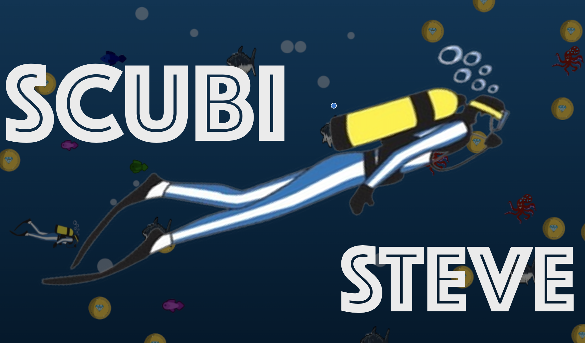
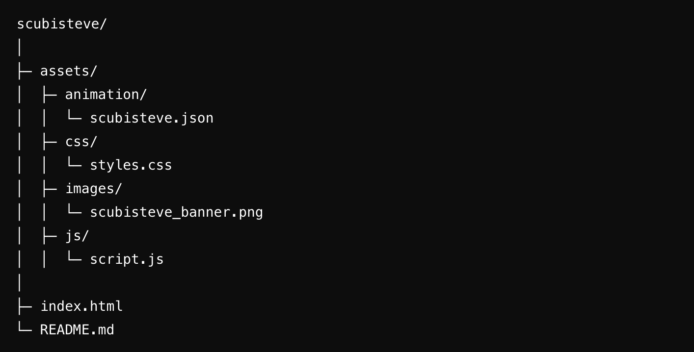

<div align="center">
  <h1>Welcome to My Repository ! 🤓</h1>
  <a href="https://www.linkedin.com/in/walidwillwhite/" target="_blank">
    
  </a>
  <a href="mailto:walidwillwhite@gmail.com" target="_blank">
    
  </a>
  <a href="https://wgwhitecoding.github.io/portfolio/" target="_blank">
    
  </a>
  <a href="https://wgwhitecoding.github.io/CoolSites/" target="_blank">
    
  </a>
  <a href="https://www.linkedin.com/company/techa-nalogy/?viewAsMember=true" target="_blank">
    
  </a>
</div>


# Scubisteve Diving Game




A scuba diving adventure game inspired by my love for diving! Immerse yourself in an underwater world as **Scubisteve**, navigating the depths, exploring marine life, and enjoying dynamic animations.

**Repository:** [https://github.com/wgwhitecoding/scubisteve](https://github.com/wgwhitecoding/scubisteve)

**Live Link** [Play Scubisteve Diving Game Live](https://wgwhitecoding.github.io/scubisteve/)

---

## Table of Contents
- [Overview](#overview)
- [Features](#features)
- [How to Play](#how-to-play)
- [Controls](#controls)
- [Installation & Setup](#installation--setup)
- [Folder Structure](#folder-structure)
- [Languages and Tools](#languages-and-tools)
- [Future Enhancements](#future-enhancements)
- [Contributing](#contributing)
- [🤝 Connect with Me](#connect-with-me)


---

## Overview

**Scubisteve Diving Game** is a browser-based game inspired by the excitement and serenity of scuba diving. This interactive experience combines JavaScript-driven logic, JSON-based animations, and CSS for visual styling to create a playful underwater adventure. Whether you're a diving enthusiast or just love the ocean, this game brings the underwater world to life.

---

## Features

- **Dive into Adventure:** Play as Scubisteve and navigate through a serene underwater world.
- **Interactive Animations:** Enjoy smooth, dynamic animations that bring the marine environment to life.
- **Simple Controls:** Navigate the depths with intuitive desktop and mobile controls.
- **Customizable Design:** Modify the animations, environment, or characters to create your unique diving adventure.

---

## How to Play

1. **Start Diving:** Open the game and take control of Scubisteve.
2. **Explore the Ocean:** Move around the underwater world and interact with the environment.
3. **Customize:** Extend the game by adding new animations, marine creatures, or actions.

---

## Controls

**Desktop:**
- **Arrow Keys:** Move Scubisteve Up, Down, Left, or Right.
- **Spacebar:** Trigger special animations or interactions.

**Mobile:**
- **Swipe:** Swipe in any direction to control Scubisteve.

---

## Installation & Setup

1. **Clone the Repository:**
   ```bash
   git clone https://github.com/wgwhitecoding/scubisteve.git

2. **Navigate to the Project Directory**
    ```bash
    cd scubisteve


3. **Open the Game**

- Open the index.html file in your favorite web browser. No additional setup or dependencies required.

## Folder Structure



## Languages and Tools

Here are the languages and tools used to build **Scubisteve Diving Game**:

[](https://developer.mozilla.org/en-US/docs/Web/HTML)  
[](https://developer.mozilla.org/en-US/docs/Web/CSS)  
[](https://developer.mozilla.org/en-US/docs/Web/JavaScript)  
[](https://www.json.org/)


## Future Enhancements

- **Underwater Wildlife:** Introduce marine creatures like fish, turtles, and corals for Scubisteve to interact with.
- **Treasure Hunt Mode:** Add a point-based system where Scubisteve collects treasures and artifacts.
- **Diving Challenges:** Include obstacles like underwater currents or tasks to complete, such as rescuing sea creatures.
- **Background Soundscapes:** Enhance the underwater experience with calming ocean sounds or bubbling effects.
- **Multiplayer Mode:** Create a mode where players can dive and explore together.

---

## Contributing

Contributions are welcome! To get involved:

1. **Fork** the repository.
2. **Create a new branch** for your feature or bugfix.
3. **Make your changes** and test thoroughly.
4. **Submit a pull request** describing your modifications.

- 1 encourage contributions that bring more life to the underwater world, enhance gameplay, or improve visuals.


## 🤝 Connect with Me <a id="connect-with-me"></a>

<div align="center">
 <p>✨ Feel free to reach out for collaborations, projects, or just a chat! ✨</p>
 
  
  <a href="https://www.linkedin.com/in/walidwillwhite/" target="_blank">
    
  </a>
  <a href="mailto:walidwillwhite@gmail.com" target="_blank">
    
  </a>
  <a href="https://wgwhitecoding.github.io/portfolio/" target="_blank">
    
  </a>
  <a href="https://wgwhitecoding.github.io/CoolSites/" target="_blank">
    
  </a>
  <a href="https://www.linkedin.com/company/techa-nalogy/?viewAsMember=true" target="_blank">
    
  </a>
</div>
<br><br>
<div align="center">
🚀 Let’s connect and build something amazing together! 🚀
</div>


